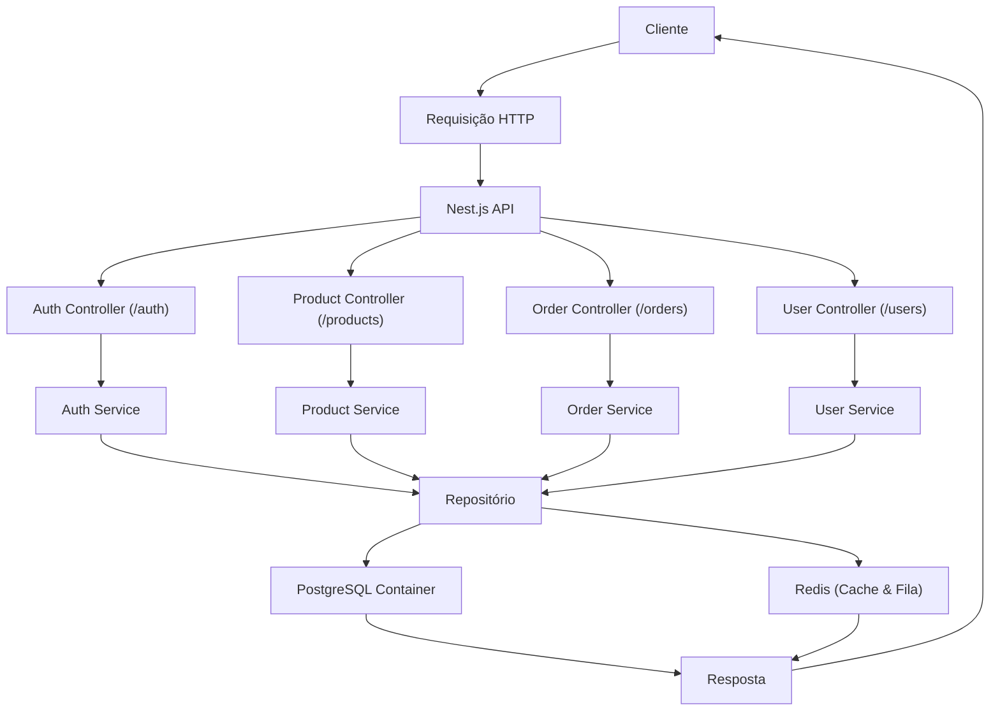
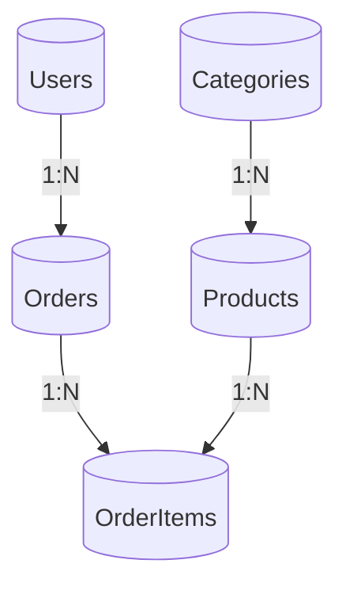

# E-commerce API

Este projeto é uma API de e-commerce construída com NestJS, utilizando TypeORM para o gerenciamento do banco de dados. A arquitetura foi pensada para suportar escalabilidade, manutenção e testes facilitados, contando também com a integração de Redis para cache e filas, e o PostgreSQL (via Docker) para o armazenamento dos dados. (Está em desenvolvimento)

## Arquitetura da Aplicação

A aplicação foi dividida em módulos que se comunicam através de controllers, services, use cases e repositórios. A seguir, são apresentados dois diagramas Mermaid que ilustram a arquitetura geral da API e os relacionamentos entre as entidades do sistema.


## Estrutura do Projeto

A organização do projeto segue uma arquitetura modular, onde cada parte da aplicação é separada por responsabilidade. Essa estrutura facilita a manutenção, escalabilidade e testes. A seguir, veja uma visão geral das pastas e arquivos principais:

├── docker-compose.yml  
│   └── Configuração dos containers (PostgreSQL, Redis) utilizados no ambiente.  
├── package.json  
│   └── Gerencia as dependências e scripts (build, start, testes etc.).  
├── tsconfig.json e tsconfig.build.json  
│   └── Configurações do TypeScript para desenvolvimento e build.  
├── nest-cli.json  
│   └── Configurações do CLI do NestJS.  
├── .prettierrc  
│   └── Configurações do Prettier para formatação do código.  
├── .gitignore  
│   └── Lista de arquivos e pastas a serem ignorados pelo Git.  
├── README.md  
│   └── Documentação do projeto (incluindo esta seção).  
└── src/  
    ├── main.ts  
    │   └── Ponto de entrada da aplicação, onde o Nest inicia o app.  
    ├── app.module.ts  
    │   └── Módulo raiz que importa os demais módulos da aplicação.  
    ├── app.controller.ts & app.service.ts  
    │   └── Exemplo de controller e serviço básicos.  
    ├── core/  
    │   └── Contém a lógica central da aplicação, dividida em:  
    │       ├── application/  
    │       │   ├── usecases/  
    │       │   │   ├── products/  
    │       │   │   │   ├── create-product.usecase.ts  
    │       │   │   │   ├── get-product.usecase.ts  
    │       │   │   │   ├── list-product.usecase.ts  
    │       │   │   │   ├── update-product.usecase.ts  
    │       │   │   │   └── delete-product.usecase.ts  
    │       │   │   └── categories/  
    │       │   │       └── (Use cases para categorias podem ser adicionados aqui)  
    │       │   └── services/  
    │       │       ├── products/  
    │       │       │   └── products.service.ts  
    │       │       └── users/  
    │       │           └── user.service.ts  
    │        
    │       └── domain/  
    │           ├── entities/  
    │           │   ├── product/  
    │           │   │   └── product.entity.ts  
    │           │   ├── categories/  
    │           │   │   └── categories.entity.ts  
    │           │   └── users/  
    │           │       └── users.entity.ts  
    │           └── repositories/  
    │               ├── product/  
    │               │   ├── product.repository.ts  
    │               │   └── interfaces/  
    │               │       └── product.interface.ts  
    │               └── users/  
    │                   ├── users.repository.ts  
    │                   └── interfaces/  
    │                       └── users.interface.ts  
    ├── modules/  
    │   └── Representa as diferentes features da aplicação, como:  
    │       ├── products/  
    │       │   ├── controllers/  
    │       │   │   └── products.controller.ts  
    │       │   ├── dtos/  
    │       │   │   ├── products/  
    │       │   │   │   ├── create-product.dto.ts  
    │       │   │   │   ├── product-response.dto.ts  
    │       │   │   │   └── update-product.request.ts  
    │       │   │   └── index.ts  
    │       │   └── modules/  
    │       │       └── product.module.ts  
    │       └── users/  
    │           ├── controllers/  
    │           │   └── users.controller.ts  
    │           └── dtos/  
    │               ├── create-user.dto.ts  
    │               ├── update-user.dto.ts  
    │               └── index.ts  
    └── test/  
        └── Contém os testes end-to-end e unitários (ex.: app.e2e-spec.ts).  

> **Observação:**  
>  
> A divisão entre as pastas “core” e “modules” serve para separar a lógica de negócio (independente de frameworks ou infraestrutura) dos detalhes de implementação de cada feature (como controllers e DTOs). Essa organização torna o sistema mais modular e favorece a escalabilidade e manutenção do código.

Sinta-se à vontade para expandir essa documentação conforme o projeto evoluir!


```markdown
A codebase apresentada demonstra uma estrutura robusta e organizada, evidenciando a aplicação de diversos princípios e boas práticas de desenvolvimento. A seguir, um resumo de onde e como esses princípios estão sendo aplicados:

---

### Separação de Responsabilidades e Modularização

- **Camadas bem definidas:**  
  - **Controllers:**  
    Estão responsáveis por lidar com as requisições HTTP e delegar as operações para os serviços. Exemplo:  
    • `src/modules/products/controllers/products.controller.ts`  
    • `src/modules/users/controllers/users.controller.ts`
  
  - **Services/Use Cases:**  
    Implementam a lógica de negócio. Os use cases orquestram operações específicas, isolando as regras de negócio dos detalhes de infraestrutura.  
    Exemplos:  
    • `src/core/application/usecases/products/create-product.usecase.ts`  
    • `src/core/application/usecases/products/list-product.usecase.ts`
    
  - **Repositórios e Entidades (Domain):**  
    Modelam os dados e encapsulam o acesso a eles através do Repository Pattern.  
    Exemplos:  
    • `src/core/domain/entities/product/product.entity.ts`  
    • `src/core/domain/repositories/product/product.repository.ts`
  
- **Módulos Independentes:**  
  Cada feature (como *products*, *users*, *categories*) possui seu próprio módulo, permitindo o desenvolvimento e manutenção isolados sem acoplamento desnecessário.  
  Exemplos:  
  • `src/modules/products/modules/product.module.ts`  
  • `src/modules/users/modules/users.module.ts`

---

### 2. Aderência aos Princípios SOLID

- **Single Responsibility:**  
  Cada classe ou componente (controller, service, use case, repositório) possui uma responsabilidade única, facilitando a manutenção e evolução do código.

- **Dependency Inversion e Interface Segregation:**  
  - A injeção de dependências, por meio do decorador `@Inject()`, permite que os componentes dependam de abstrações (interfaces) e não de implementações concretas.  
  - Exemplos:  
    • A interface `ProductRepositoryInterface` em `src/core/domain/repositories/product/interfaces/product.interface.ts` guia a implementação do repositório, que é injetado em serviços e use cases.  
    • O `UsersInterface` define as operações para a entidade de usuários, favorecendo testes unitários e a troca de implementações sem impactar o restante do sistema.

- **Open/Closed Principle:**  
  - A arquitetura utilizando use cases e injeção de dependências permite que o sistema seja estendido para novos cenários sem precisar alterar as classes existentes.

---

### 3. Clean Architecture e Domain-Driven Design (DDD)

- **Clean Architecture:**  
  A separação entre a camada de aplicação (use cases, services), a camada de domínio (entities, regras de negócio) e a camada de infraestrutura (controllers, repositórios) é clara.  
  - As regras de negócio ficam isoladas nos componentes do domínio e dos use cases, enquanto as preocupações com frameworks ficam nos controllers e módulos específicos.
  
- **Domain-Driven Design:**  
  - A modelagem das entidades (por exemplo, `ProductEntity` e `CategoriesEntity`) reflete o domínio do problema.  
  - Os use cases (como `CreateProductUseCase`, `UpdateProductUseCase`) encapsulam a lógica específica do domínio, facilitando o entendimento e a evolução conforme as regras de negócio se tornam mais complexas.

---

### 4. Validação e DTOs

- **Data Transfer Objects (DTOs):**  
  - DTOs são utilizados para definir o formato dos dados que entram e saem dos controllers, como `CreateProductRequest` e `UpdateProductRequest` (ex.: `src/modules/products/dtos/products/create-product.dto.ts`, `src/modules/products/dtos/products/update-product.request.ts`).
  
- **Validação de Dados:**  
  - Com o uso de decorators do `class-validator` (como `@IsString`, `@Length`, `@IsNumber`) os dados são validados automaticamente, garantindo integridade e consistência antes de serem processados pela lógica de negócio.

---

### 5. Testabilidade

- **Testes End-to-End (E2E) e Unitários:**  
  - A estrutura de testes (diretório `src/test` e arquivo `jest.config.js`) demonstra uma preocupação com a qualidade e confiabilidade do sistema.
  - A dependência injetada permite a substituição fácil de componentes durante os testes, facilitando o isolamento das funcionalidades e a realização de testes unitários precisos.

---

### 6. Outras Boas Práticas

- **Uso de Docker Compose:**  
  - O arquivo `docker-compose.yml` centraliza a configuração de containers do PostgreSQL e Redis, garantindo um ambiente de desenvolvimento e produção consistente.

- **Ferramentas de Qualidade de Código:**  
  - A utilização do Prettier (`.prettierrc`), ESLint, e as configurações do NestJS CLI ajudam a manter o código limpo, consistente e dentro dos padrões estabelecidos.

- **Configuração Centralizada:**  
  - O uso do módulo `@nestjs/config` e dos arquivos `.env` permite uma configuração centralizada, facilitando a customização e mudança de comportamento do aplicativo sem precisar modificar o código-fonte.

---

### Conclusão

Em resumo, a codebase está bem estruturada e se alinha aos principais princípios modernos de desenvolvimento:

- **Princípios SOLID:**  
  - A separação de responsabilidades, o uso de injeção de dependências e a definição de interfaces garantem um código modular e de fácil manutenção.

- **Clean Architecture / Domain-Driven Design:**  
  - A distinção clara entre as camadas de domínio, aplicação e infraestrutura permite que a lógica de negócio permaneça isolada dos detalhes de implementação.

- **Boas Práticas de Modularização, Validação e Testes:**  
  - O uso de DTOs, ferramentas de validação, e a integração de testes demonstram um compromisso com a qualidade, segurança e escalabilidade do código.

Essa organização não só facilita o desenvolvimento e a escalabilidade como também resulta em um código mais confiável e robusto, apto a suportar futuras mudanças e o crescimento do sistema.
```


### Diagrama Geral da API


### Diagrama de Relacionamento de Entidades



## Estrutura do Projeto

A aplicação segue uma organização modular que inclui:

- **Controllers**: Responsáveis por receber as requisições HTTP e delegar para os serviços correspondentes.
- **Services**: Contêm a lógica de negócios da aplicação.
- **Use Cases**: Implementam cenários de uso específicos e orquestram a interação entre os serviços e repositórios.
- **Repositories**: Realizam a comunicação com a camada de dados usando o TypeORM.
- **Entities**: Modelam as tabelas e relações do banco de dados.

Essa arquitetura promove a separação de responsabilidades, facilitando a manutenção, teste e escalabilidade da aplicação.

## Pré-requisitos

- Node.js (v14 ou superior)
- PostgreSQL
- Redis

## Configuração do Ambiente

Crie um arquivo `.env` na raiz do projeto com as seguintes variáveis de ambiente:

```
DB_HOST=localhost
DB_PORT=5432
DB_USERNAME=seu_usuario
DB_PASSWORD=sua_senha
DB_DATABASE=nome_do_banco
PORT=3000
```

## Instalação e Execução

1. Subir o docker do PostgreSQL e Redis:

   ```bash
   docker-compose up -d
   ```


2. Instale as dependências:

   ```bash
   yarn install
   ```

3. Execute a aplicação em modo de desenvolvimento:

   ```bash
   nest build 
   ```

4. Execute a aplicação em modo de desenvolvimento:

  ```bash
  nest start 
  ```

## Testes

Para rodar os testes da aplicação, utilize o comando:

```bash
npm run test
```

## Licença

Este projeto está licenciado sob a licença MIT.

---

Sinta-se à vontade para contribuir com melhorias e reportar issues.
