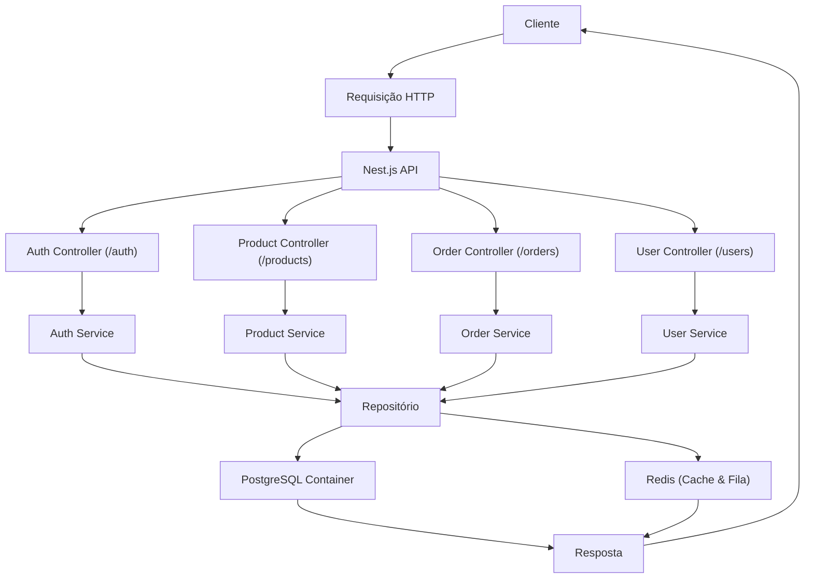
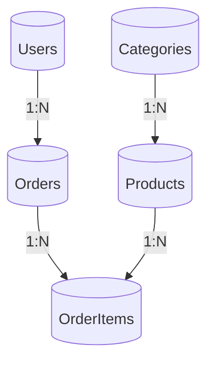

# E-commerce API

Este projeto é uma API de e-commerce construída com NestJS, utilizando TypeORM para o gerenciamento do banco de dados. A arquitetura foi pensada para suportar escalabilidade, manutenção e testes facilitados, contando também com a integração de Redis para cache e filas, e o PostgreSQL (via Docker) para o armazenamento dos dados. (Está em desenvolvimento)

## Arquitetura da Aplicação

A aplicação foi dividida em módulos que se comunicam através de controllers, services, use cases e repositórios. A seguir, são apresentados dois diagramas Mermaid que ilustram a arquitetura geral da API e os relacionamentos entre as entidades do sistema.

### Diagrama Geral da API


### Diagrama de Relacionamento de Entidades



## Estrutura do Projeto

A aplicação segue uma organização modular que inclui:

- **Controllers**: Responsáveis por receber as requisições HTTP e delegar para os serviços correspondentes.
- **Services**: Contêm a lógica de negócios da aplicação.
- **Use Cases**: Implementam cenários de uso específicos e orquestram a interação entre os serviços e repositórios.
- **Repositories**: Realizam a comunicação com a camada de dados usando o TypeORM.
- **Entities**: Modelam as tabelas e relações do banco de dados.

Essa arquitetura promove a separação de responsabilidades, facilitando a manutenção, teste e escalabilidade da aplicação.

## Pré-requisitos

- Node.js (v14 ou superior)
- PostgreSQL
- Redis

## Configuração do Ambiente

Crie um arquivo `.env` na raiz do projeto com as seguintes variáveis de ambiente:

```
DB_HOST=localhost
DB_PORT=5432
DB_USERNAME=seu_usuario
DB_PASSWORD=sua_senha
DB_DATABASE=nome_do_banco
PORT=3000
```

## Instalação e Execução

1. Subir o docker do PostgreSQL e Redis:

   ```bash
   docker-compose up -d
   ```


2. Instale as dependências:

   ```bash
   yarn install
   ```

3. Execute a aplicação em modo de desenvolvimento:

   ```bash
   nest build 
   ```

4. Execute a aplicação em modo de desenvolvimento:

  ```bash
  nest start 
  ```

## Testes

Para rodar os testes da aplicação, utilize o comando:

```bash
npm run test
```

## Licença

Este projeto está licenciado sob a licença MIT.

---

Sinta-se à vontade para contribuir com melhorias e reportar issues.
